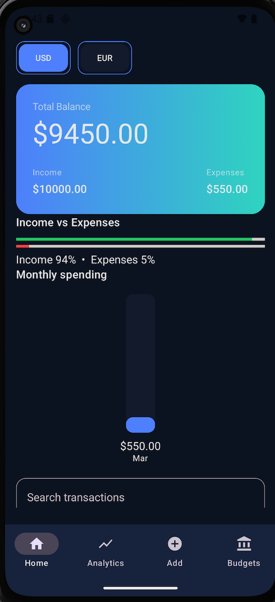
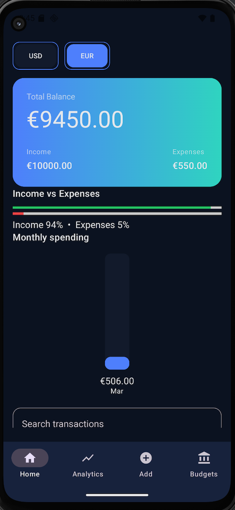
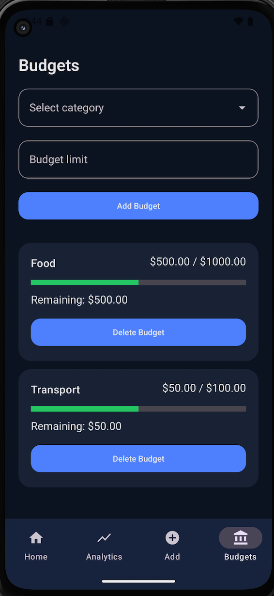
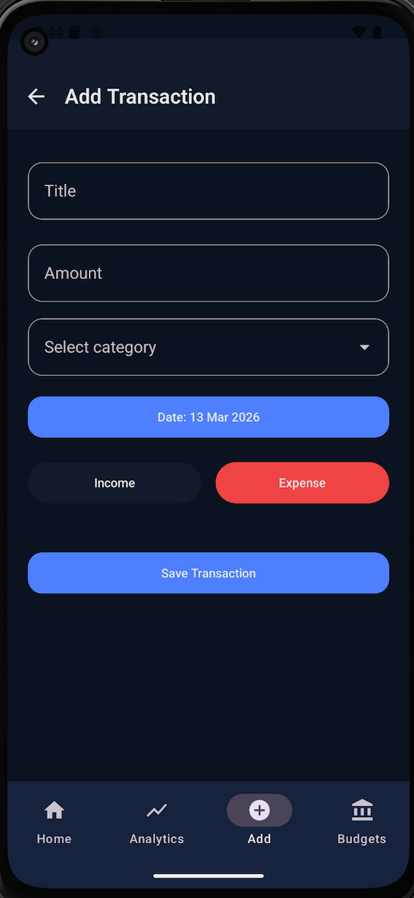
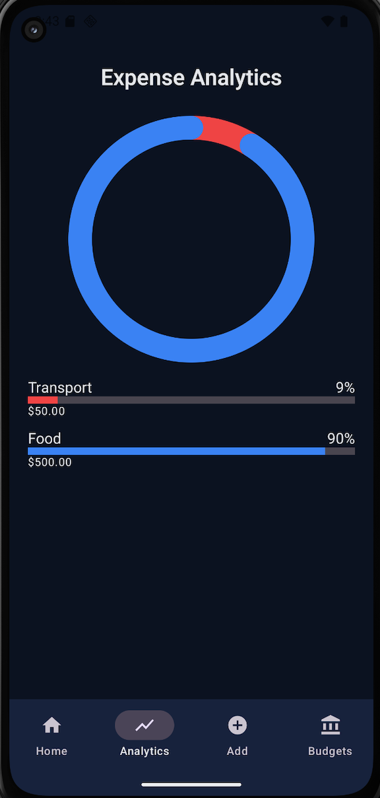
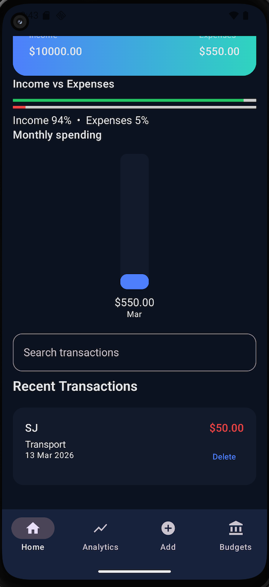

# FinanceTracker

## Project Overview

FinanceTracker is an Android application for managing personal finances.

The application allows users to track income and expenses, manage budgets, and analyze spending patterns. The project demonstrates modern Android development practices including **Clean Architecture**, **MVVM architecture**, **dependency injection**, and reactive data handling using **Kotlin Coroutines and Flow**.

---

## Features

- Track income and expenses
- Create and manage category-based budgets
- Analyze spending patterns with charts
- Currency switching (USD / EUR)
- Search transactions
- Modern UI built with Jetpack Compose
- Local data persistence using Room Database

---

## Tech Stack

- Kotlin
- Jetpack Compose
- Room Database
- Hilt (Dependency Injection)
- MVVM Architecture
- Kotlin Coroutines & Flow
- Android Studio

---

## Architecture

The project follows **Clean Architecture** combined with the **MVVM (Model–View–ViewModel)** pattern.

- com.younes.financetracker
  - data
    - datastore
    - local
      - dao
      - database
      - entity
    - repository
  - di
  - domain
    - repository
  - presentation
    - components
    - navigation
    - screens
    - utils
    - viewmodel
  - theme
  - FinanceTrackerApp
  - MainActivity

---

## Architecture Overview

The application follows the **MVVM pattern**:

1. **UI Layer (Jetpack Compose Screens)**  
   Handles user interaction and displays data.

2. **ViewModel Layer**  
   Manages UI state and business logic.

3. **Repository Layer**  
   Acts as an abstraction between ViewModel and the data layer.

4. **Data Layer (Room Database / DAO)**  
   Handles local data persistence.

---

## Screenshots

### Home

### Currency Switch

### Budgets

### Add Transaction

### Analytics

### Recent Transactions

## Installation

Download the project and open it in Android Studio.

1. Download the repository as a ZIP file
2. Extract the ZIP
3. Open the project folder in Android Studio
4. Let Gradle sync and run the app

## Developer

Younes Barka

GitHub  
https://github.com/YounesBarka00

LinkedIn  
https://www.linkedin.com/in/younes-barka-b5b45136a/